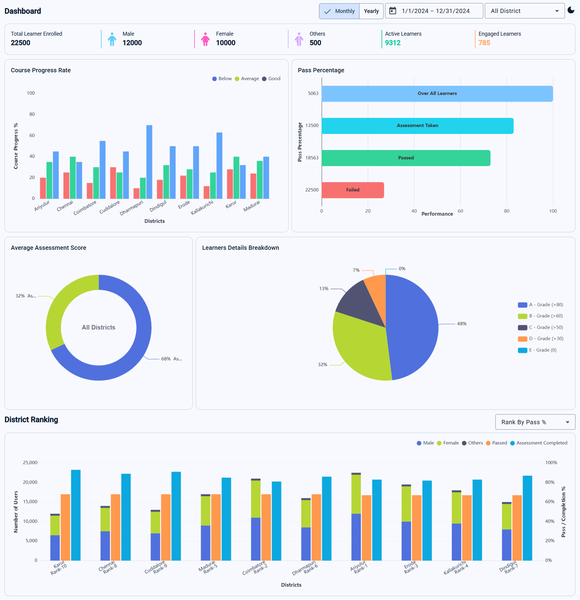
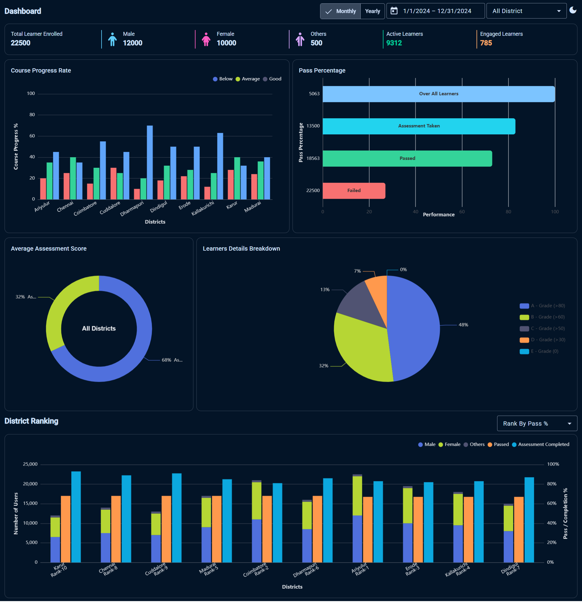

# Learning Analytics Dashboard – Frontend Assignment

Angular dashboard application for learner insights/analytics. Built with Angular 21, Angular Material, NgRx, ECharts, and Tailwind.

## Screenshots

### Light Mode



### Dark Mode



## Prerequisites

- **Node.js**: Angular 21 requires a modern Node version (recommended **Node 20+**).
- **npm**: This repo pins **npm 11.6.2** (see `package.json` `"packageManager"`).

## Setup

Clone the repository:

```bash
git clone https://github.com/SathishSmpth/nila-apps-assessment-task.git
cd nila-apps-assessment-task
```

Install Angular CLI:

```bash
npm install -g @angular/cli
```

Install dependencies:

```bash
npm install
```

## Run locally

Start the dev server:

```bash
ng serve
```

Then open `http://localhost:4200/`.

## Data / assumptions

- **Dashboard data source**: The app loads data from `assets/dashboard.json` via Angular `HttpClient`.
  - Source file in this repo: `public/assets/dashboard.json`
  - Served URL in the app: `assets/dashboard.json`
- **Expected shape**: The top-level JSON is expected to be keyed by **year** (string), and the app reads `data[year]`.
- **No backend required**: All data is currently static and served from the app assets.

## Note:
If a Vite dev overlay error appears, the app still runs correctly at http://localhost:4200.
This is a known Angular + Vite dev-server issue.

